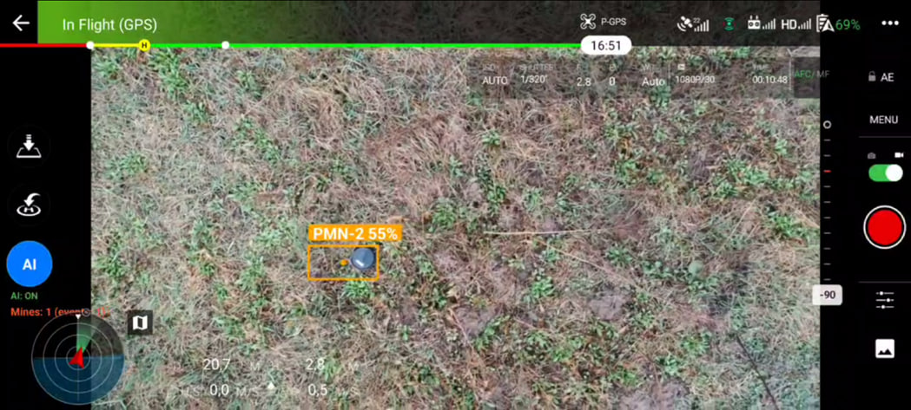
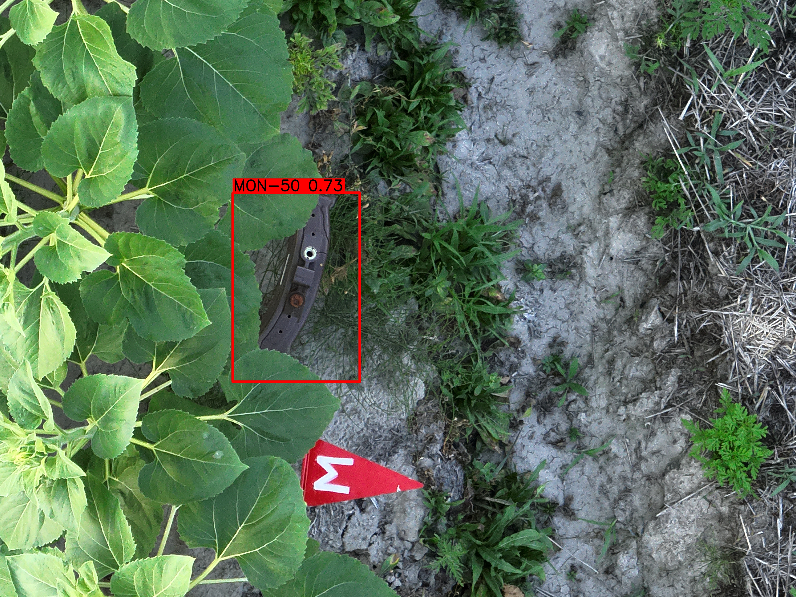
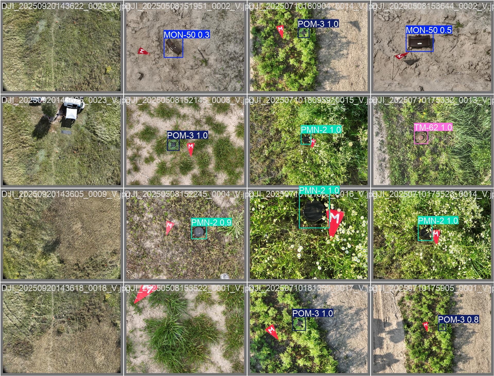
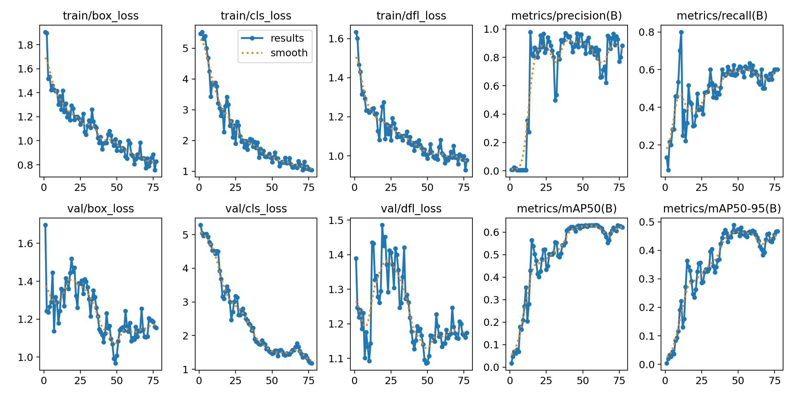
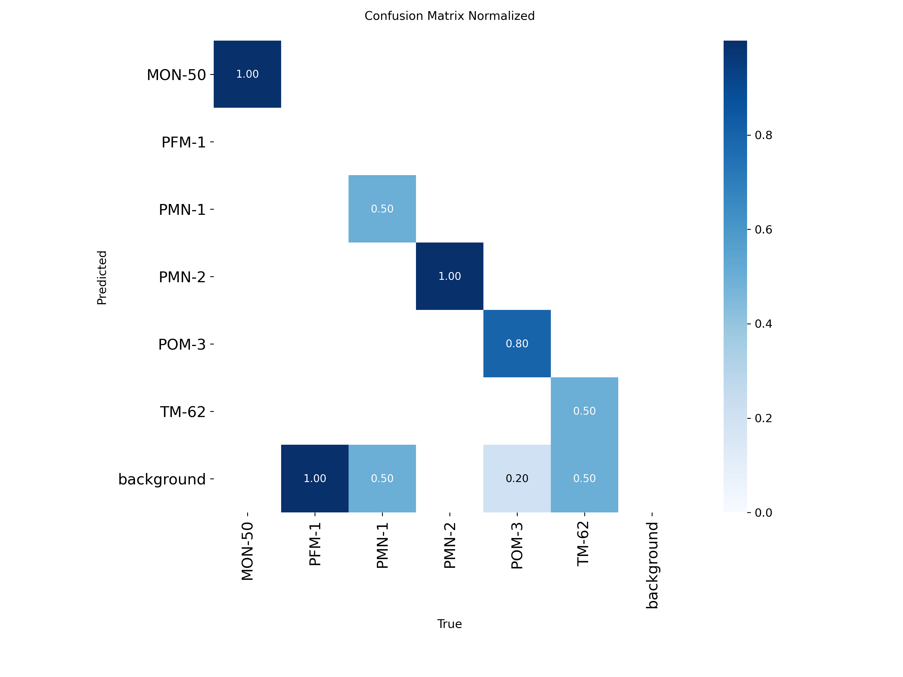

# MineDetector

Android research prototype for detecting potential mine-like objects from DJI drone imagery using on-device computer vision.

MineDetector combines DJI Mobile SDK, a YOLO-based detection pipeline, TensorFlow Lite inference, drone telemetry, detection overlays, local storage and experimental map visualization.

The project was developed as a bachelor thesis project in Software Engineering. The main goal was to test how UAV imagery and mobile AI inference can be used for remote visual inspection of potentially dangerous areas.

> This project is a research prototype. It is not intended for direct operational use without further testing, validation and professional review.

---

## Demo

https://github.com/user-attachments/assets/0ae0caf1-5a76-499f-8ab6-bfbf725829f8


---

## Main idea

The application receives imagery from a DJI drone, processes frames locally on an Android device and highlights objects that look similar to predefined dangerous object classes.

The system is designed as a support tool for visual inspection. It does not confirm that an object is explosive or safe.

The main value of the project is the full prototype workflow: drone imagery input, Android-based AI inference, detection overlay, telemetry usage and result visualization.

---

## Visual results

### Android detection overlay



### Detection example from UAV imagery



### Validation batch predictions



---

## Features

- DJI drone connection through DJI Mobile SDK v4
- Live camera stream processing
- YOLO-based object detection
- TensorFlow Lite inference on Android
- Optional ONNX detector module
- Detection overlay with bounding boxes and confidence values
- Drone telemetry display
- Local test mode for images and videos
- Detection history stored locally
- Room database integration
- Experimental map-based visualization
- Optional backend synchronization
- Helper scripts for dataset processing, training and deployment

---

## Tech stack

| Part | Technology |
| --- | --- |
| App | Android |
| Language | Kotlin |
| Build system | Gradle Kotlin DSL |
| Drone SDK | DJI Mobile SDK v4 |
| Detection | YOLO |
| Inference | TensorFlow Lite |
| Optional inference | ONNX Runtime |
| Maps | Mapbox |
| Database | Room |
| Networking | Retrofit, OkHttp |
| Background jobs | WorkManager |
| Backend | FastAPI |
| Backend services | Docker, PostgreSQL, Redis |

---

## Model and dataset overview

The model was trained on a custom UAV image dataset with multiple mine-like object classes.

Classes used in the experiment:

- MON-50
- PFM-1
- PMN-1
- PMN-2
- POM-3
- TM-62

---

## Prototype limitations

MineDetector was developed as a research and bachelor thesis prototype, not as a production-ready detection system.

The training dataset was relatively small and limited in object variety, lighting conditions, backgrounds, flight altitude, camera angles and capture scenarios. Because of this, the model can produce unstable detection results, miss objects or confuse visually similar classes.

The main focus of the project was not to build a fully reliable mine detection model, but to demonstrate the complete application workflow:

- UAV imagery input
- Android-based on-device inference
- YOLO / TensorFlow Lite integration
- Detection overlay
- Drone telemetry usage
- Local testing workflow
- Experimental result visualization

With a larger and more diverse dataset, additional validation and further model tuning, the detection quality could be improved.

---

## Training results

The project used a YOLO-based object detection pipeline. The final model was exported for local/mobile inference.

The training and validation plots below show the experimental model behavior on the available dataset. Because the dataset was limited, these results should be treated as prototype-level results rather than production-level model performance.

### Training metrics



### Normalized confusion matrix



---

## Repository structure

```text
MineDetector/
├── app/
│   ├── backend/                  # Optional FastAPI backend
│   ├── scripts/                  # Dataset, training and deployment scripts
│   └── src/main/
│       ├── assets/               # Labels and local model files
│       ├── java/com/minedetector/
│       │   ├── data/             # Room database, DAO, entities, repositories
│       │   ├── dji/              # DJI connection, camera, stream and telemetry logic
│       │   ├── ml/               # Detection pipeline
│       │   ├── network/          # API client and network models
│       │   ├── services/         # Sync and model update services
│       │   ├── ui/               # Activities, fragments and custom views
│       │   ├── utils/            # Utility classes
│       │   └── video/            # Video frame processing
│       └── res/                  # Android resources
├── assets/
│   ├── images/                   # README screenshots and selected plots
│   └── videos/                   # Demo video
├── gradle/
├── build.gradle.kts
├── settings.gradle.kts
├── gradle.properties
├── gradlew
├── gradlew.bat
├── local.properties.example
├── LICENSE
└── README.md
```

---

## Media files used in README

Place the following files in the repository:

```text
assets/images/featured-minedetector.jpg
assets/images/DJI_20250710182421_0002_V.jpg
assets/images/val_batch0_pred.jpg
assets/images/results.png
assets/images/confusion_matrix_normalized.png

assets/videos/demo.mp4
```

---

## Setup

Clone the repository:

```bash
git clone https://github.com/NickStS/MineDetector.git
cd MineDetector
```

Open the project in Android Studio.

Recommended environment:

```text
Android Studio Hedgehog or newer
JDK 17
Android SDK 34
Android device with API 24+
```

Create a local configuration file:

```bash
cp local.properties.example local.properties
```

Example `local.properties`:

```properties
sdk.dir=/path/to/Android/Sdk

DJI_API_KEY=YOUR_DJI_API_KEY_HERE
MAPBOX_ACCESS_TOKEN=YOUR_MAPBOX_ACCESS_TOKEN_HERE
GOOGLE_MAPS_API_KEY=YOUR_GOOGLE_MAPS_KEY_HERE

SERVER_URL=https://api.example.com/
```

`local.properties` is ignored by Git and should not be committed.

---

## Model files

Trained model files are not included in this repository.

Place the local TensorFlow Lite model here:

```text
app/src/main/assets/yolo_mine_detector.tflite
```

Optional ONNX model:

```text
app/src/main/assets/yolo_mine_detector.onnx
```

Labels file:

```text
app/src/main/assets/labels.txt
```

Model files, datasets and training outputs are excluded from Git because they may be large or private.

---

## Build

Windows:

```bat
gradlew.bat assembleDebug
```

Linux / macOS:

```bash
./gradlew assembleDebug
```

Debug build output:

```text
app/build/outputs/apk/debug/
```

---

## Optional backend

The backend is located in:

```text
app/backend/
```

Run it with Docker Compose:

```bash
cd app/backend
docker compose up --build
```

The backend can be used for detection upload, model metadata, model download, feedback and statistics.

The Android app can also be tested without the backend.

---

## Notes

This repository does not include:

```text
local.properties
API keys
trained models
datasets
APK/AAB builds
Gradle build outputs
Android Studio local files
```

Before pushing changes, check that no private data is included:

```bash
grep -RniE "API_KEY|TOKEN|SECRET|PASSWORD|AIza|sk-|pk\." .
```

---

## Status

This is a research prototype. The main purpose of the project is to demonstrate the integration of UAV imagery, Android-based AI inference, drone telemetry and detection result visualization.

The current model was trained on a limited dataset, so detection quality should be treated as experimental. The project is not intended for direct operational use without a larger dataset, further testing, validation and professional review.

---

## License

This project is licensed under the MIT License. See [LICENSE](LICENSE).
